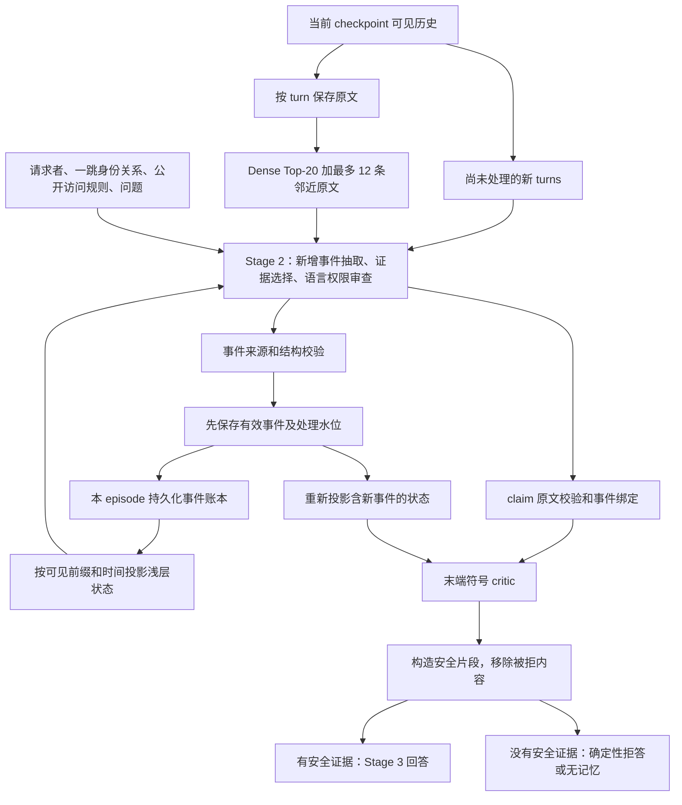

# V8 当前 pipeline：调用链、责任与诊断边界

2026-09-19。依据当前工作树源码静态核对；不修改算法、不调用 API、不训练。
默认入口是 `configs/govmem_v8_late_governance_gemini25flashlite.yaml`：
shallow memory、JSON 协议、source turn ID、Gemini 2.5 Flash-Lite、temperature 0。
LoRA 往后放，先明确现有 pipeline 的职责与失效位置。

## 一句话定义

保留原文，用浅层事件账本记住权限和生命周期变化；查询时让语言模型选证据并判断适用范围，程序核对来源、状态和明确绑定的限制，只把获准片段交给回答模型。

这不是通用知识图谱，也不是仅给 RAG 末尾加一条拒答规则。

## 实际信息流

图中是逻辑依赖。实际执行先准备增量与必要的冷启动抽取，再做检索；普通新增历史的抽取与查询审查合并在一次 Stage 2 调用里。

## 每一步究竟做什么

| 环节 | 输入与输出 | 责任和边界 | 源码入口 |
|---|---|---|---|
| 可见输入 | checkpoint 截止位置之前的 turns、问题、请求者 | adapter 截断未来 turns；runner 按 episode、可见历史长度排序 | `data/adapters.py::_visible_messages_until_checkpoint`；`pipeline.py::run` |
| 原文 bank / 检索 | 一 turn 一 chunk → Top-20；补最多 12 条相邻 turns | 不把普通事实改写成图节点；当前路径不调用 LLM query planner | `backbones/govmem_v8_late_governance.py::_build_turn_chunks/run_instance` |
| 增量事件准备 | 处理水位之外的新 turns、最多 8 条前置上下文、已有资源注册表 | 正常在 Stage 2 抽取；过大的新历史先分批抽取，不能静默截断 | 同文件 `_prepare_ingestion` |
| 状态投影 | 累积事件 → 当前请求者权限、有效期、生命周期事件 | 确定性处理可见性、时间和结构化状态；条件的自然语言含义留给 LLM | `governance_runtime/v8_state_projector.py::project_v8_state` |
| 浅层展示 | 状态 → 一跳身份关系、权限记录、生命周期记录、资源注册表 | 默认隐藏同绑定的较早普通更新，保留删除记录；不是删除原文或账本 | `governance_runtime/v8_shallow_memory.py::shallow_graph_context/shallow_lifecycle_view` |
| Stage 2 | 上述信息与公开规则 → `events`、`query_slots`、`claims`、`answer_action` | 同一次调用负责抽取、证据选择、权限/删除/时序语义和事件绑定 | `governance_runtime/v8_claim_reasoner.py::reason_v8_claims` |
| 事件落盘 | 新事件 → 来源/schema 校验 → 账本和已处理 turn 水位 | 在 query claim 校验前提交；有效事件不因后续回答失败而丢失 | backbone 中 `accept_events`；`v8_event_store.py::append/save` |
| claim 校验 | 模型选择的原文片段与 bind → 规范化 claim | 验证原文、偏移、拒绝引文、事件 ID、资源/action/scene 一致性；不证明语义适用性 | `v8_claim_reasoner.py::_validate_claims`；`extraction/v8_line_protocol.py::bind_claim_events` |
| 符号 critic | claim + 更新后的状态 → 必要时改成 block | 执行明确绑定、有效、无条件、全资源的 deny/delete 等窄规则；不做词语相似度授权 | `governance_runtime/v8_symbolic_critic.py::criticize_v8_claims` |
| 安全证据 | 审查后 claims → 获准原文和无被拒值的槽位说明 | 去掉 blocked 值与理由引文；同一来源的重叠受限区间会遮蔽 | `governance_runtime/v8_safe_evidence.py::build_v8_safe_evidence` |
| Stage 3 | 问题、请求者、获准片段、被拒槽位 → 回答文本 | 有安全证据时再调用 Gemini；无安全证据时由程序给出 refuse/no_memory | backbone 中 `_answer_from_safe_evidence` |

表中源码均相对 `src/gov_mem/`。

## 必须分清的三种数据

1. **原文**：事实、旧值、权限语句都仍在原文 bank 中。治理删除目前是禁止披露语义，不是物理擦除原文与所有缓存。
2. **事件账本**：只持久化权限与生命周期事件及其引文；shallow 路径拒绝模型输出通用 scene/entity/fact/relation 图。账本跨 checkpoint 复用。
3. **回答 claims**：本次查询选择的具体原文证据；每次重新计算，不是下一轮的普通事实记忆。

`keep=true` 表示模型判断整条候选都安全后，由程序复制原文；混合敏感记录应选择局部原文片段。`summary` 的支撑证据同样要求原文，并非允许 Stage 2 自由生成摘要事实。

## 七个容易误解、但影响下一步设计的事实

### 1. 获准证据不只来自 Top-20

默认 `candidate_id_style=source` 允许选取已展示在 graph/ingestion 中的来源片段，包括新增 turns 和上下文。程序不会据此查出未展示的全文；不能把不连续引文拼成一条虚构原文。

因此必须分别记录 dense、邻近原文、账本引文、新增历史的证据贡献。不能把额外证据覆盖带来的收益全部归因于符号推理。

### 2. 抽取“应与问题无关”是提示要求，不是结构隔离

普通 checkpoint 的抽取和审查在同一次请求里，模型看得到当前问题。有效 `events=[]` 也会推进处理水位，之后默认不重新抽取这些 turns。

所以漏抽可能持续影响后续状态；通过 schema 和引文校验不等于完整抽取，也不等于事件语义正确。目前尚未在本次审计中量化此类错误。

### 3. 新事件立即影响符号检查，但没有自动再做一轮语言审查

第一次 Stage 2 看到旧账本和新增原文，并同时生成新事件与 claims。新事件有效入库后程序重新投影，末端 critic 使用更新后的状态。正常路径不会把新投影再发给 LLM 重审一次。

这避免每题增加一次调用，也意味着模型必须在同一次生成中保持新事件与 claims 一致。

### 4. 符号层是真实执行的，但依赖语义绑定

模型先决定某个事件是否适用于某个具体 claim，程序才核对绑定并执行明确否决。放行 claim 可以在检查后显式返回空 bind；程序不会因为缺边自动拒绝。

因此漏抽、漏绑、错误资源归一化均可能绕开这条兜底路径；错绑也可能过度拦截。没有 critic veto 不能解释为“已经证明安全”。同样，带引文的拒绝不自动证明该限制适用于这个请求者和片段。

### 5. 旧更新折叠发生在展示层

当前按 issuer/grantee/resource/action/scene 折叠 active、无条件、无范围/有效期限制的 update/supersede/cancel，没有字段级完整替代判据。

“同一会议改地点，再改时间”可错误隐藏仍有效的地点事件。原文与账本还在，不保证当前 prompt 包含该地点。另一方面，全部保留在确认性样本上未复现收益，不能直接切默认。

当前权限投影、生命周期展示是两套规则，修改时不能混成一个“最新事件覆盖所有历史”的通用逻辑。

### 6. 一道题失败不等于本轮没有状态变化

已通过验证的新事件先落盘；后续 claim 校验或回答失败不回滚。最多一次 contract repair 可以复用已入库事件，此时请求不再含刚处理的 ingestion。

修复请求的可见来源可能与初次不同：新增全文不再通过 ingestion 提供，只有仍在 RAG/邻近候选或账本引文中的部分保留。此设计的实际影响需结合保存请求诊断，不能仅把 repair 当成完全相同输入的重试。

归因时要区分“事件未提交”“事件已提交但 claim 失败”“安全证据已生成但回答失败”，并记录失败对后续 checkpoint 的影响。

### 7. Stage 3 的证据边界不等于最终回答的形式化保证

程序构造受限的证据输入；问题与请求者仍传入 Stage 3。模型生成后检查回答非空、筛选 claim 引用，并按被拒请求槽位决定 answer/answer_redacted；没有第二次完整的回答语义验证。

`assert_runtime_payload_safe` 检查隐藏评测字段混入，不能描述为最终文本的隐私泄露检测器。不得把“被拒值未作为证据传入”扩大为“任何问题注入或模型幻觉都不可能造成泄露”。

## 调用与失败成本

- 普通成功 checkpoint：1 次 Stage 2 + 有安全证据时 1 次 Stage 3。
- 无安全证据：不调用 Stage 3，程序确定 refuse/no_memory；背景安全片段不能让全部请求槽位被拒的情况变成部分回答。
- 冷启动例外：超过 64 个新 turns 或 24,000 字符时，按最多 32 turns 分批预抽取；默认最多 4 次 prefill，超预算报错。
- 协议例外：backbone 最多追加 1 次 Stage 2 contract repair。HTTP 重试、embedding 请求、官方 judge 另计，不能混成“始终两次 API”。
- 默认配置 fail-fast；完整实验可显式记录 `action=error` 后继续。执行失败不能冒充正确拒答，也不能从完整 episode 评分中删除。

## 下一步按什么顺序做

**先做历史轨迹归因，再决定结构修改。** 保持当前默认行为，复用已保存开发轨迹，建立每 checkpoint 的信息链：

`可见原文 → 实际提供的来源 → 抽取事件 → 展示状态 → claim 与 bind → critic → 安全片段 → 最终回答`

对失败和成功对照都标注：检索/来源缺失、事件漏抽或语义错误、状态展示遗漏、语言放行/拒绝错误、绑定/符号作用、输出协议失败、Stage 3 偏离。允许多因共存；证据不足标为未确定，不强行分配唯一原因。人工诊断可参考已保存判分，但 gold/judge 信息不得进入 runtime 或反向生成 benchmark 词表。

分别统计执行错误和内容错误，区分本 checkpoint 的直接错误与先前错误状态的累积影响。沿用历史官方标签，有争议另记。先使用既有开发集；如果用确认性样本做调优诊断，应明确其随后变为开发数据，并继续禁止用于训练/蒸馏。

优先待验证的结构改进是字段级、带来源证据的替代关系：同资源不同字段保留；同字段明确完整替代才隐藏旧状态；条件、期限、删除、撤销各自处理。先用独立通用场景覆盖边界，再决定是否接入默认 V8。暂不拆出新增模型调用，不启动 LoRA。

## 本次核验与结果口径

本次完成配置、runner、backbone、来源汇总、浅层 schema、事件持久化、状态投影、绑定、critic、安全证据与回答边界的源码阅读。只新增本文与 README 导航；未运行测试或实验，不产生新 MGS。

当前源码含嵌套拒绝格式兼容修复，尚无含此修复的端到端 MGS。开发集 40.06%、确认性 Full 31.18% 均属于各自冻结实现和样本，不能直接标在当前工作树上。

相关记录：

- [模块消融](../experiments/result/2026-09-19_Gov-Mem-v8_module_ablation_results.md)
- [确认性结果及边界](../experiments/result/2026-09-19_Gov-Mem-v8_confirmation_and_training_readiness.md)
- [本地训练决策](GOVMEM_V8_LOCAL_TRAINING_DECISION.md)
