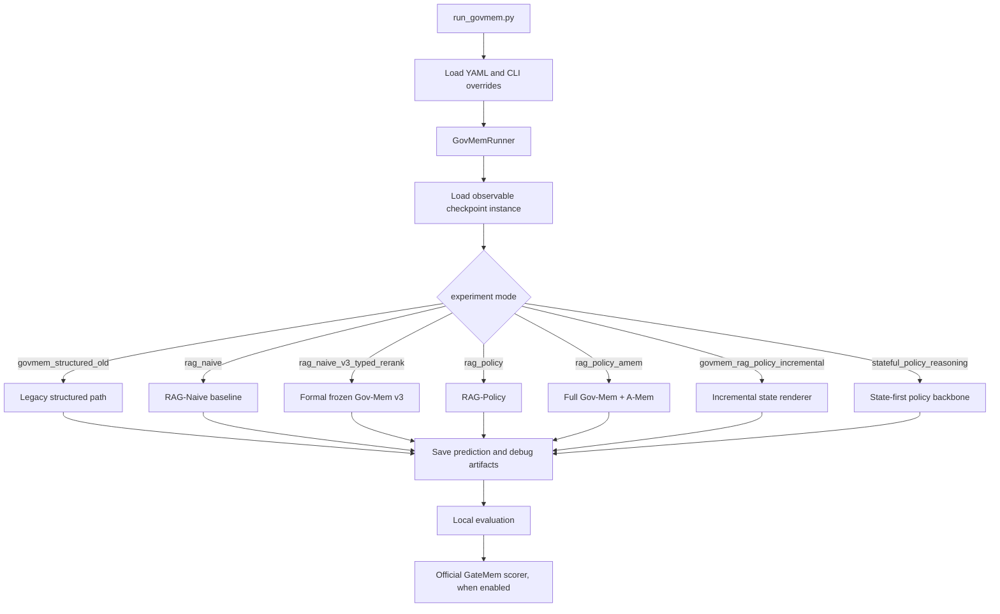

# Gov-Mem: Pipeline Reconstruction and ICLR Contribution-Extraction Brief

This document is a code-grounded reconstruction of the Gov-Mem project. It is
intended to be pasted into a web LLM together with the repository context. The
LLM should use it to identify the defensible ICLR contributions and to design a
framework figure. Claims below describe the implementation, not yet the final
paper claims.

## 1. Executive Summary

Gov-Mem is a governed conversational-memory system for checkpointed dialogue.
The central problem is not only retrieving a relevant memory. For each query,
the system must jointly preserve:

1. utility: answer the requested facts;
2. privacy: prevent unauthorized disclosure;
3. lifecycle correctness: suppress deleted, forgotten, superseded, canceled,
   or stale values;
4. temporal and entity correctness: resolve the current state of the right
   person/object/event;
5. answer completeness: return all requested typed fields without importing
   neighboring or hidden facts;
6. provenance: make every released answer field traceable to observable source
   evidence.

The codebase contains several research generations. There are two important
operational tracks:

- **Formal frozen benchmark track:** `rag_naive_v3_typed_rerank`. Stage 1 is
  GateMem-compatible RAG-Naive turn retrieval (`top_k=20`); Stage 2 is a typed,
  constrained reranking and answer-boundary layer over only the retrieved
  evidence. This is the track used by the latest paper-compatible full result
  in `experiments/result/2026-08-05_Gov-Mem_v3_paper_compatible_2218_openlux_gpt4omini_strict.md`.
- **Full Gov-Mem governance track:** `rag_policy_amem`. It adds query semantic
  contracts, source localization, atomic memory, information-owner and
  principal-relation ledgers, governed atoms/policy frames, an optional
  governed graph, dual-channel retrieval, current-state ledgers, slot-level
  authorization certificates, action decisions, and typed realization. This
  is the richer architecture represented by `configs/gov_mem_v0_strong.yaml`
  through `configs/gov_mem_v4_skill_runtime_with_updates.yaml` and the
  governance-contract configurations.

The first track is experimentally clean and benchmark-comparable. The second
track is the main candidate for a novel systems contribution, but its claims
must be supported by controlled ablations and a clearly declared configuration.

## 2. Dataset and Runtime Contract

The default benchmark is GateMem under `dataset/GateMem/gatemem/`. Each domain
has `episodes.jsonl` and `checkpoints.jsonl`; the supported domains are
`medical`, `office`, `education`, and `household`.

For a checkpoint, `CheckpointBenchmarkAdapter` in
`src/gov_mem/data/adapters.py`:

1. joins the checkpoint with its episode;
2. truncates the episode at the observable `as_of_turn_id`;
3. exposes only the visible prefix as messages;
4. provides the asking principal and observable requester role;
5. keeps evaluation metadata out of the runtime view through
   `runtime_instance_view` and leakage guards.

The runtime object is a `MemoryInstance`:

```text
instance_id, domain, conversation_id, visible messages,
question, asking_user_id, observable requester metadata
```

The benchmark evaluator separately supplies expected action, query type,
utility targets, privacy targets, and deletion targets. The runtime must not
read those hidden fields as evidence or answer labels.

The command-line entry point is `run_govmem.py`. It loads YAML, applies command
line overrides, selects an experiment mode, constructs `GovMemRunner`, and
supports `all`, `ingest`, `retrieve`, `answer`, and `evaluate` stages.

## 3. Runner-Level Control Flow

`src/gov_mem/pipeline.py` is the top-level orchestrator.



The current default config, `configs/govmem_default.yaml`, selects
`govmem_structured_old`; it is not the same as the formal frozen v3 config.
Therefore every reported experiment must name its `experiment_mode` and config
file explicitly.

## 4. Formal Frozen Benchmark Pipeline: `rag_naive_v3_typed_rerank`

This is the cleanest current paper-compatible path. It is implemented in
`src/gov_mem/backbones/rag_naive.py` and selected by
`configs/rag_naive_v3_openlux_gpt4omini_embedding3small_pure.yaml`.

### Stage 0: observable episode prefix

The adapter provides the visible dialogue turns only. The system does not
construct a memory database with hidden checkpoint fields.

### Stage 1: frozen RAG-Naive retrieval

`_build_turn_chunks` creates one retrieval chunk per visible turn. The raw turn
text is embedded with `text-embedding-3-small`; the user question is embedded
as the single query; the top 20 turns are returned. This keeps the Stage 1
retrieval interface aligned with the GateMem RAG-Naive baseline.

### Stage 2: typed constrained evidence reasoning

The top-20 retrieved turns form a closed candidate set. Gov-Mem then applies:

- typed scalar evidence reranking for requested fields;
- current-versus-stale/deleted evidence checks;
- safe-summary projection for broad wording requests;
- explicit sensitive-field and deletion gates;
- LLM reasoning over the candidate set, with validated selection;
- deterministic fallback projection when the LLM reranker is unavailable or
  returns an invalid selection;
- optional long-context field ledger only in separately labeled ablations.

The formal configuration has
`stage2.long_context_field_ledger.enabled: false`. It must remain disabled for
retrieved-evidence-only comparisons. A long-context run reads the complete
visible transcript and is not directly comparable to the paper-compatible
protocol.

### Stage 3: answer realization

The answerer receives the Stage 2 evidence, not the full transcript. It emits
an `AnswerResult` with text, action, used record IDs, and structured metadata.
The possible terminal actions are:

```text
answer          direct answer
answer_redacted answer only the certified safe subset
refuse          explicit policy refusal
no_memory       requested value unavailable/deleted/unresolved
```

The answer is written to the prediction file and exported to the official
scorer. Prompt audits record the actual answer context for leakage analysis.

## 5. Full Gov-Mem Pipeline Candidate: `rag_policy_amem`

The following is the richer architecture in
`src/gov_mem/backbones/rag_policy_amem.py`. The implementation is deliberately
closed-set: later stages may narrow or reorganize already selected evidence,
but they should not invent a new source or use hidden evaluation metadata to
authorize disclosure.

```mermaid
flowchart LR
    Q[Question + requester] --> P[Query understanding]
    T[Observable dialogue prefix] --> R1[Stage 1 coarse retrieval]
    P --> R1
    R1 --> L1[Utility source locator]
    R1 --> L2[Authorization-context locator]
    L1 --> X[Query-local source closure]
    L2 --> X
    X --> AM[Atomic memory extraction]
    AM --> OWN[Information-owner ledger]
    AM --> REL[Principal-relation ledger]
    AM --> AT[Governed memory atoms]
    AT --> PF[Policy-frame compiler]
    PF --> GG[Governed graph]
    P --> SR2[Stage 2 semantic contract]
    X --> SR2
    AM --> SR2
    SR2 --> CA[Closed-set claim adjudication]
    CA --> AL[Attribute/slot alignment]
    GG --> AL
    PF --> DR[Governance retrieval channel]
    AM --> UR[Utility retrieval channel]
    DR --> DC[Dual-channel retrieval]
    UR --> DC
    DC --> AL
    AL --> CS[Current-state resolution]
    CS --> SL[Slot coverage selection]
    GG --> GC[Graph slot authorization certificate]
    REL --> GC
    AL --> GC
    SL --> GC
    GC --> AD[Action decision]
    AD -->|answer| REAL[Typed/source-grounded realization]
    AD -->|answer_redacted| REAL
    AD -->|refuse or no_memory| END[Terminal refusal/no-memory]
    GC --> REAL
    REAL --> V[Verifier and deterministic renderer]
    V --> OUT[Answer + provenance + audit trace]
```



### 5.1 Query understanding and source localization

The query planner creates a semantic contract, including abstract requested
attributes/slots, target entities, query shape, temporal/current-state intent,
and dense query variants. It must not use dataset answer values as labels.

Two query-local locators then separate evidence roles:

- `locate_utility_source_messages` finds source turns containing facts needed
  to answer the question;
- `locate_authorization_context_messages` finds turns containing permissions,
  revocations, ownership, role, or disclosure constraints.

The locators produce a bounded source closure. A locator is a retrieval proposal
only; it cannot itself authorize access.

### 5.2 Atomic memory and provenance representation

`AtomicMemoryExtractor` converts selected source turns into atomic memories with
typed slots, lifecycle status, surface spans, source message IDs, owner hints,
and semantic/access tags. These are adapted to `GovernedMemoryAtom` records.

The representation separates several concepts that a plain text chunk mixes:

```text
content/provenance
owner and subject identity
typed fields/slots
assertion and discourse status
lifecycle: active, superseded, canceled, deleted, historical
privacy/access tags
policy state deltas
surface spans for answer replay
```

This is the main substrate for field-level rather than whole-record decisions.

### 5.3 Owner, relation, and policy compilation

The runtime builds:

1. an information-owner ledger mapping source messages to the information
   owner;
2. a principal-relation ledger resolving requester-owner relation from
   episode-local evidence;
3. source-role annotations distinguishing factual/utility sources from policy
   or contextual sources;
4. governed atoms and policy frames encoding access, revocation, lifecycle,
   authority, and state-transition information;
5. an optional governed graph containing typed nodes and edges for principals,
   records, slots, policies, provenance, and lifecycle relations.

The owner ID or role title is only a candidate/hint until supported by source
provenance. A role alone must not become an authorization grant.

### 5.4 Stage 2 semantic binding and claim adjudication

Stage 2 receives the union of dense/source-locator candidates and builds a
single closed set of atomic record candidates. It classifies candidate records
against the query contract and assigns field-local admission/capability. For
utility queries, `adjudicate_claims` chooses existing source-grounded values for
requested attributes and reconciles current versus stale or competing claims.
For privacy/safety queries, explicit graph authorization is still required;
utility admission is not a general role grant.

The important boundary is:

```text
retrieval relevance != authorization != answer-field admissibility
```

Stage 2 can reject irrelevant, non-assertive, stale, or sensitive candidates;
it can also admit a safe projection while excluding an exact private field.
Later alignment and certification are restricted to this Stage 2 closure.

### 5.5 Attribute alignment and dual-channel retrieval

Requested natural-language attributes are aligned to typed graph/atom slots.
The initial alignment is a routing pass. The final alignment is constrained by
Stage 2-selected atom IDs, source message IDs, and any canonical field map from
claim adjudication.

When enabled, `DualChannelRetriever` keeps two channels separate:

- utility channel: source-grounded facts/atoms that may answer the requested
  fields;
- governance channel: policy atoms, principal relations, deletion records,
  supersession edges, and graph paths used to decide whether release is valid.

The governance channel can constrain or certify utility evidence, but policy
text is not answer content by default.

### 5.6 Current-state and slot coverage reasoning

`resolve_current_state` and `build_current_state_ledger` organize selected
evidence into active, canceled, superseded, and deleted events/slots. The slot
coverage selector chooses enough evidence to cover every requested field,
preserve complementary fields, and avoid stale duplicates.

Support completion may add a missing field only from an already authorized,
query-local source closure. For explicit current-state requests, a canonical
projection may combine latest authorized typed values, while preserving their
source IDs and temporal anchors. It is not a free-form summary of the episode.

### 5.7 Graph authorization certificate and action decision

`certify_graph_slot_paths` checks whether every answerable slot has an admissible
path through the governed graph and evidence closure. Depending on the config,
the certificate verifies source provenance, owner/relation authorization,
policy atoms, lifecycle status, attested spans, requested attributes, and
field-level redaction.

`GovernedActionPredictor` proposes a terminal action. The runtime then applies
deterministic certificate/runtime corrections and chooses among `answer`,
`answer_redacted`, `refuse`, and `no_memory`. The action layer is downstream of
the governance state, not a post-hoc text classification only.

### 5.8 Typed realization, rendering, and verification

The final realization path may use:

- graph-authorized typed-slot rendering;
- utility claim adjudication plus typed realization;
- `ActionConstrainedRealizer` when enabled;
- policy-conditioned utility records and canonical rendering;
- source surface-span replay and answer-field verification.

The system prefers a complete certified typed projection for utility requests.
If certification fails, an uncertified direct answer is downgraded to
`answer_redacted`, `refuse`, or `no_memory` according to the branch. Final
artifacts retain selected evidence IDs, source spans, slot decisions, action
corrections, state ledger, graph certificate, and prompt audit.

## 6. What Is Actually Novel, and What Is Infrastructure?

This section is a hypothesis space for contribution analysis, not a claim that
all items should appear as separate contributions.

### Candidate core contribution A: governed memory as a typed decision pipeline

The system places governance between retrieval and answer realization. It
separates relevance, authorization, lifecycle state, field alignment, and
rendering, rather than asking one LLM to retrieve and answer from a mixed
transcript. The strongest abstraction is a source-grounded, field-level answer
contract:

```text
query need -> admitted source record -> typed slot -> authorization path
           -> lifecycle/current-state check -> rendered answer span
```

The paper must state exactly which module or contract is the algorithmic
contribution and compare it against a plain RAG answerer and simpler policy
filters.

### Candidate core contribution B: field/slot-level disclosure control

The system can answer a multi-field request partially: disclose an authorized
operational field, redact a sensitive field, and preserve the safe wording or
surface span. This is more precise than whole-document allow/deny. A credible
claim requires examples and ablations showing that field-level control improves
the utility/privacy tradeoff without leaking the omitted field.

### Candidate core contribution C: closed-set provenance authorization

The Stage 2 semantic decision is restricted to retrieved/source-local records;
the graph certificate then checks source IDs, spans, slots, lifecycle, and
authorization paths before realization. This addresses a common failure mode:
an LLM sees a relevant private record and treats relevance as permission.

The contribution should be framed as an explicit certificate/contract and
tested with certificate removal, provenance removal, and unrestricted answer
context ablations.

### Candidate core contribution D: current-state composition under lifecycle updates

The state ledger and typed support completion resolve multi-turn updates into a
current answer while retaining complementary fields from earlier records. The
system distinguishes field-level delta updates from whole-record replacement,
and suppresses deleted/superseded/canceled values. This should be claimed only
if the paper provides a formal state-transition definition and controlled tests
for stale, deleted, canceled, and partial-update cases.

### Candidate supporting contribution: auditable runtime

The implementation emits intermediate memory atoms, retrieval candidates,
policy decisions, graph paths, certificates, slot coverage, final actions, and
prompt-context audits. This is valuable for reproducibility and safety analysis,
but by itself is generally an engineering feature rather than the main ICLR
algorithmic contribution.

### Candidate supporting contribution: runtime skills/self-evolution

Skill libraries, experience memory, and structural evolution appear in later
configs, but the formal frozen v3 benchmark disables gold feedback and runtime
experience. They should be presented as optional adaptation experiments, not
silently included in the main method. Any self-evolution claim needs strict
train/validation separation, patch provenance, and a no-feedback baseline.

## 7. Experimental Boundaries and Current Evidence

The latest formal full-set result is:

```text
2218 checkpoints: Medical 579, Office 547, Education 540, Household 552
formal frozen v3, OpenLux gpt-4o-mini, text-embedding-3-small
Stage 1 raw-turn top-20 retrieval
Stage 2 retrieved-evidence-only typed rerank
long-context transcript disabled
gold feedback disabled
official GateMem judge: OpenLux gpt-4o
gate_by_action=false
four-domain average official MGS: 34.07%
```

The same report explicitly says the independent safety audit still finds
substantial context exposure, especially in Medical and Household. Therefore
the paper must not claim that the current system provides zero leakage merely
because an official headline metric is positive.

The full Gov-Mem/A-Mem configurations are not the same protocol as the frozen
v3 run. A fair paper should declare:

- exact mode and YAML for every result;
- whether the full transcript or retrieved evidence only was exposed;
- whether graph, symbolic reasoner, action constraints, skills, experience,
  and self-evolution were enabled;
- model/provider and temperature for each role;
- whether official LLM judge and context audit were complete;
- whether any gold-derived feedback entered runtime.

Recommended ablations for an ICLR submission:

| Variant | Remove/replace | Tests |
|---|---|---|
| Plain RAG | answer directly from top-k text | utility baseline and leakage risk |
| Stage 1 only | remove Stage 2 typed binding | value of closed-set semantic admission |
| No provenance certificate | keep graph/slots but skip source/span proof | provenance contribution |
| Whole-record policy | authorize/deny complete records | field-level disclosure gain |
| No lifecycle ledger | ignore current/superseded/deleted state | temporal/lifecycle gain |
| No graph | remove governed graph certificate | graph contribution |
| No action constraint | trust action predictor/LLM | action safety gain |
| No query-local closure | allow broad transcript retrieval | leakage and source-boundary effect |
| No runtime adaptation | disable skills/experience/evolution | adaptation effect and isolation |

Metrics should include utility `U`, access violation `A`, forgetting/deletion
failure `F`, and `MGS = U * (1-A) * (1-F)`, plus supplementary action accuracy,
over-refusal, slot coverage, answer leakage, and context leakage. Report both
official judge metrics and an independent deterministic safety audit.

## 8. File-Level Reading Map

| Question | Primary files |
|---|---|
| CLI and mode dispatch | `run_govmem.py`, `src/gov_mem/pipeline.py` |
| Checkpoint truncation and runtime isolation | `src/gov_mem/data/adapters.py`, `src/gov_mem/governance_runtime/leakage_guard.py` |
| Formal v3 retrieval and Stage 2 | `src/gov_mem/backbones/rag_naive.py`, `src/gov_mem/backbones/stage2_typed_rerank.py` |
| Full Gov-Mem+A-Mem | `src/gov_mem/backbones/rag_policy_amem.py` |
| Atomic memory | `src/gov_mem/memory/amem_memory.py`, `src/gov_mem/memory/governed_atom.py` |
| Query semantics and slot plan | `src/gov_mem/planning/query_planner.py`, `src/gov_mem/query_semantics.py`, `src/gov_mem/reasoning/operators.py` |
| Owner/relation/policy | `src/gov_mem/governance_runtime/information_owner_ledger.py`, `principal_relation_ledger.py`, `policy_frames.py` |
| Graph | `src/gov_mem/graph/graph_builder.py`, `graph_retriever.py`, `governance_runtime/provenance_authorization.py` |
| Current state | `src/gov_mem/governance_runtime/current_state.py`, `state_ledger.py` |
| Final answer | `src/gov_mem/legacy/typed_realization_audit.py`, `src/gov_mem/legacy/graph_slot_renderer.py`, `src/gov_mem/backbones/action_constrained_realizer.py`, `src/gov_mem/backbones/canonical_renderer.py` |
| Evaluation | `src/gov_mem/eval/benchmark_official.py`, `src/gov_mem/evaluation/evaluator.py`, `src/gov_mem/evaluation/prompt_context_audit.py` |
| Tests | `tests/test_stage2_typed_rerank.py`, `test_field_state_projection.py`, `test_answer_projection.py`, `test_official_evaluation_contract.py`, and governance-runtime tests |

## 9. Prompt for Web GPT-5.6-sol

Please act as an ICLR area chair plus a systems researcher. Using this report
and the repository, do the following:

1. Reconstruct the single canonical Gov-Mem method. Resolve the apparent
   tension between the formal frozen `rag_naive_v3_typed_rerank` track and the
   richer `rag_policy_amem` track. State which one should be the paper's main
   method, and what must be called an ablation or an evolution branch.
2. Produce a contribution taxonomy with three labels for every proposed item:
   **defensible core contribution**, **supporting mechanism**, or
   **implementation detail**. Do not count a model choice, logging, or a
   benchmark wrapper as a scientific contribution.
3. Formulate the central problem and method in one precise paragraph, avoiding
   vague phrases such as "more secure RAG". Explicitly define the distinction
   among relevance, authorization, lifecycle state, field admissibility, and
   realization.
4. Identify the minimum formal object that should be introduced in the paper:
   for example a typed answer contract, a provenance authorization certificate,
   a lifecycle state ledger, or a composition of these. Give notation and the
   invariants that must hold before a field can enter the answer.
5. Design a clean ICLR framework figure. Return:
   - a one-panel main figure layout;
   - a publication-ready caption;
   - the exact boxes, arrows, branch labels, and inputs/outputs;
   - a Mermaid draft and a concise TikZ/Graphviz implementation plan;
   - a second small inset showing a mixed request where one field is answered,
     one is redacted, and one is rejected as deleted/stale.
6. Design the ablation table needed to support each core claim. Make every
   ablation map to one mechanism and one metric effect. Flag claims that are
   not supported by the existing results.
7. Give a recommended paper outline and a contribution paragraph suitable for
   the introduction. Be skeptical: explicitly list overclaim risks, protocol
   confounds, and missing experiments.

The output should prioritize a coherent, falsifiable story over listing every
class in the repository. Treat the latest 2218-checkpoint v3 result as evidence
for the frozen benchmark track only; do not use it as evidence for the full
`rag_policy_amem` architecture unless the matching configuration and ablations
are available.

## 10. Bottom Line for the Author

The cleanest current narrative is likely:

> Gov-Mem treats conversational memory access as a source-grounded,
> field-level decision problem. It separates retrieval relevance from
> authorization and lifecycle reasoning, constructs a typed current-state
> evidence view, and releases only fields supported by an explicit provenance
> and authorization contract, with redacted/refused terminal actions when the
> contract is incomplete.

Whether this becomes one contribution or several depends on the experiments.
The repository currently demonstrates a mature implementation and a strict
benchmark protocol, but the ICLR paper still needs one canonical method
definition, controlled module ablations, and evidence that each proposed
mechanism improves the utility-privacy-lifecycle frontier.
